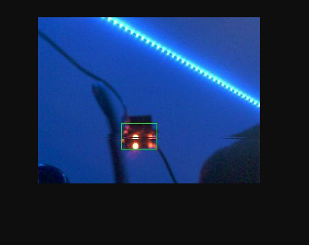

# ESP32 Autonomous Delivery Robocar

An autonomous delivery robot powered by ESP32, featuring real-time color tracking, motor control, and web-based streaming interface.

## Overview

This project implements a vision-guided autonomous robot that can track and follow colored objects in real-time. The robot uses an ESP32-WROVER CAM microcontroller with a camera module to capture video frames, processes them to detect objects of specific colors (red, orange, yellow, green, cyan, blue, or purple), and controls differential drive motors to navigate toward the detected target.

The system converts RGB565 camera frames to HSV color space for robust color detection under varying lighting conditions. A weighted centroid algorithm calculates the target position, which feeds into a proportional controller for smooth steering corrections.

## How It Works

### Vision Pipeline

1. **Frame Capture**: The OV3660 camera captures frames in RGB565 format at QVGA resolution (320×240)
2. **Color Conversion**: Each pixel is converted from RGB to HSV color space for lighting-invariant detection
3. **Blob Detection**: Pixels matching the target hue range are identified and aggregated
4. **Centroid Calculation**: A saturation/value-weighted centroid provides the target's precise location
5. **Bounding Box**: The algorithm computes a tight bounding box around the detected object

### Motor Control

The robot uses a differential drive system with proportional control:
- **Error Calculation**: Horizontal offset from frame center determines steering correction
- **PWM Control**: 13-bit resolution PWM at 4kHz drives the motors smoothly
- **Speed Mixing**: Base speed ± turn effort creates left/right wheel speed differential

### Web Interface

A built-in web server streams live video with overlay visualization:
- Real-time MJPEG stream at ~12 FPS
- Green bounding box around detected objects
- Blue crosshair marking the calculated centroid
- Accessible from any browser on the same network

## Features

- **Color Tracking**: Real-time object detection and tracking using HSV color space analysis
- **Motor Control**: Proportional control with 13-bit PWM resolution for smooth navigation
- **Web Streaming**: Live MJPEG video feed with overlay visualization via HTTP server
- **BLE Support**: Bluetooth Low Energy driver for wireless communication and control
- **Sensor Hub**: Integrated sensor management for extensibility
- **Navigation**: Autonomous path planning and target following

## Components

| Component | Description |
|-----------|-------------|
| `motor_driver` | Dual H-bridge motor control with LEDC PWM (4kHz, 13-bit resolution) |
| `web_streamer` | WiFi HTTP server serving MJPEG stream with real-time overlays |
| `common` | Shared types: HSV pixels, color ranges, blob structures, FreeRTOS queues |
| `tools` | Color tracker with RGB→HSV conversion and weighted blob detection |
| `ble_driver` | Bluetooth Low Energy functionality for remote control |
| `navigator` | Navigation logic and path planning algorithms |
| `sensor_hub` | Sensor integration and data processing |

## Supported Colors

The color tracker supports the following predefined HSV hue ranges:

| Color | Hue Range |
|-------|-----------|
| Red | 170° - 10° (wraps around) |
| Orange | 11° - 25° |
| Yellow | 26° - 34° |
| Green | 35° - 85° |
| Cyan | 86° - 99° |
| Blue | 100° - 130° |
| Purple | 131° - 169° |

## Color Tracking in Action

Below is a screenshot of the web interface showing the color tracking feature( set to red ) with bounding box and centroid visualization:




## Hardware Requirements

- ESP32 development board (with PSRAM recommended for frame buffers)
- OV3660 camera module (or compatible, comes with WROVER CAM model)
- Dual H-bridge motor driver (DRV8833, or similar)
- 4 DC gear motors with wheels (differential drive)
- Power supply (7.4V LiPo recommended for motors, 5V for ESP32)
- Chassis/frame

### Pin Configuration

| Function | GPIO |
|----------|------|
| Motor Left A | GPIO 18 |
| Motor Left B | GPIO 19 |
| Motor Right A | GPIO 32 |
| Motor Right B | GPIO 33 |
| Camera (XCLK) | See camera config |

## Getting Started

### Prerequisites

- ESP-IDF v5.x or later
- Python 3.x

### Configuration

1. Copy `main/secrets.h.example` to `main/secrets.h` and update with your WiFi credentials:
   ```c
   #define SECRET_SSID "your_wifi_ssid"
   #define SECRET_PASS "your_wifi_password"
   ```

2. (Optional) Adjust camera and motor settings in `main/esp32-autonomous-delivery-robocar.c`

### Build and Flash

```bash
idf.py build
idf.py flash
idf.py monitor
```

### Accessing the Web Interface

After flashing, the ESP32 will connect to your WiFi network. Check the serial monitor for the IP address:

```
DASHBOARD READY: http://192.168.x.x/
```

Open this URL in any browser to view the live stream with color tracking overlay.

## Architecture

```
┌─────────────────┐     ┌──────────────────┐     ┌─────────────────┐
│  Camera Module  │────▶│  Color Tracker   │────▶│   Navigator     │
│   (OV3660)      │     │  (HSV Analysis)  │     │ (P-Controller)  │
└─────────────────┘     └──────────────────┘     └────────┬────────┘
                                │                         │
                                ▼                         ▼
                        ┌──────────────────┐     ┌─────────────────┐
                        │  Web Streamer    │     │  Motor Driver   │
                        │ (MJPEG + Overlay)│     │  (PWM Control)  │
                        └──────────────────┘     └─────────────────┘
```


